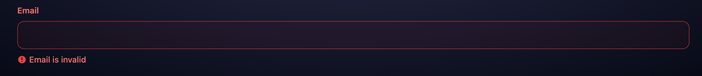
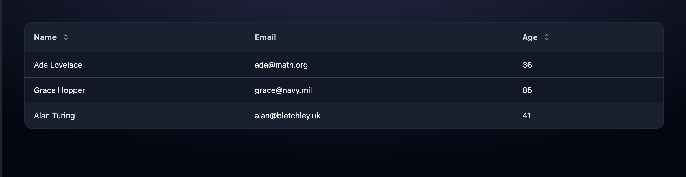
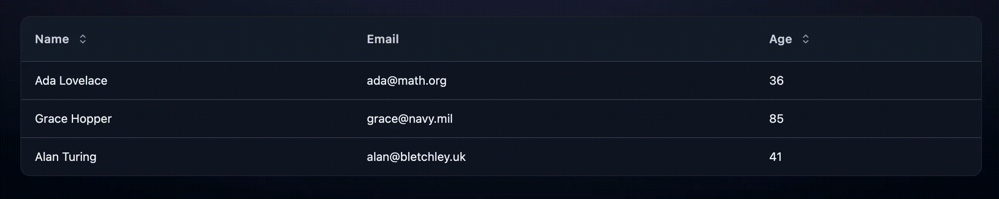
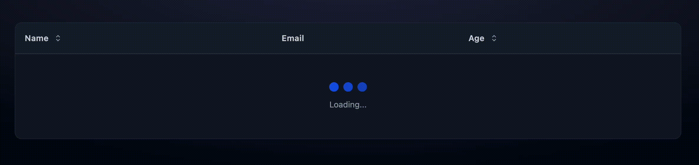
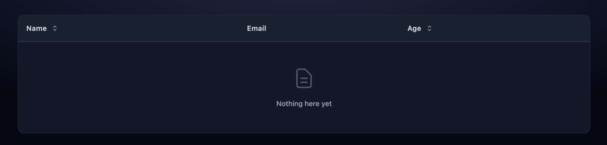
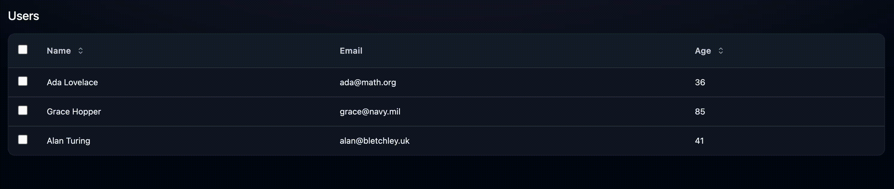
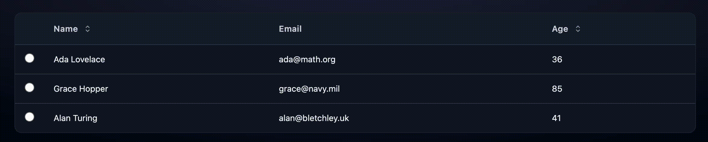
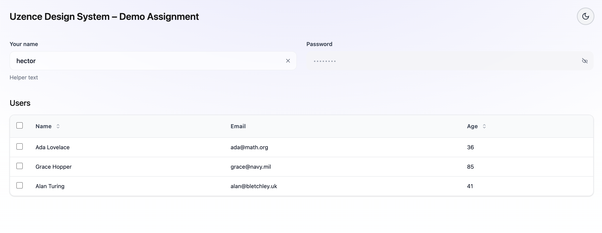
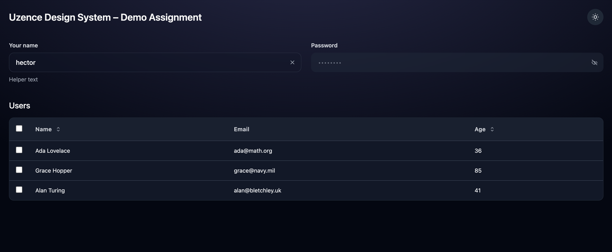

# Uzence Design System – Front-End Assignment

#### This project is a **mini design system** built with **React, TypeScript, TailwindCSS, Storybook and Vitest** as part of the Front-End Internship assignment for **Uzence Design Studio**.  
#### It demonstrates reusable, accessible, and responsive UI components documented in Storybook.

---

## ▶️ Demo

- **Complete Storybook Demo:** [Complete Demo](https://68a69abeb4a85a6bcb93aef6-cqootrftzs.chromatic.com/?path=/story/data-display-datatable--basic)
- **Storybook DataTable:** [DataTable Demo](https://www.chromatic.com/component?appId=68a69abeb4a85a6bcb93aef6&csfId=data-display-datatable&buildNumber=3&k=68a6b171a0412fa8aec39124-1200px-interactive-true&h=32&b=-1)
- **Storybook Input:** [Input Demo](https://www.chromatic.com/component?appId=68a69abeb4a85a6bcb93aef6&csfId=form-inputfield--with-error&buildNumber=3&k=68a6b171a0412fa8aec3912c-1200px-interactive-true&h=36&b=-3)

---

## 🚀 Tech Stack

- **React** with **Vite** for fast development.
- **TypeScript** for type safety.
- **TailwindCSS (@tailwindcss/vite)** for utility-first styling.
- **Storybook** for interactive component documentation.
- **Vitest + Testing Library** for unit/integration tests.
- **ESLint + Prettier** for code quality and consistency.

---

## ⚙️ Setup Instructions

Clone and install dependencies:

```bash
git clone https://github.com/your-username/uzence-design-system.git
cd uzence-design-system
npm install
```

Run the project locally:

```bash
npm run dev        # start Vite app demo
npm run storybook  # start Storybook (http://localhost:6006)
npm run test       # run test suite
```

Build production bundles:

```bash
npm run build      # build Vite app
npm run build-storybook # build Storybook (storybook-static/)
```

---

## 🎨 Components

### 1. InputField

A flexible and accessible input component with:

- **Variants**: `outlined`, `filled`, `ghost`.
- **Sizes**: `sm`, `md`, `lg`.
- **States**: **normal**, **invalid**, **loading**, **disabled**.
- **Features**: clearable input, password toggle, helper & error text.
- **Accessibility**: `aria-invalid`, `aria-describedby`, keyboard-friendly focus.

📸 Example:





### 2. DataTable

A responsive table component supporting:

- **Column sorting** (`aria-sort` enabled).
- **Row selection** (single or multiple).
- **Loading state** with spinner.
- **Empty state** with customizable message.
- **Stable row keys** via `rowKey` prop.
- **Accessibility**: semantic `<table>`, focusable headers, keyboard-friendly checkboxes/radios.

📸 Example:












---

## 🌗 Light & Dark Mode

The design system supports both themes. In Storybook you can toggle **Light/Dark** from the toolbar.

📸 Example:




---

## 🧪 Testing

Unit tests are written with **Vitest + Testing Library**.

- **InputField**: label rendering, helper/error messages, clear button functionality.
- **DataTable**: column sorting, row selection (single/multiple).

Run tests:

```bash
npm run test
```

---

## 📖 Approach & Decisions

1. **Atomic Design Principles** – components are designed to be **small, reusable, and composable**.
2. **Variants with `cva` (Class Variance Authority)** – to scale size/variant/state logic in a type-safe way.
3. **Accessibility First** – proper ARIA roles, `aria-sort`, `aria-invalid`, focus states, and Storybook A11y checks.
4. **Theming** – Dark/Light mode handled via Tailwind's `dark:` variant and a global Storybook toggle.
5. **Documentation** – Storybook stories show usage, controls, and states to make adoption easy across teams.
6. **Testing** – Unit tests validate interactivity (sorting, clearing, error handling).
7. **Scalability** – Components were built with extension in mind (e.g. `rowKey`, `selectionMode` for DataTable).

---

## 📸 Storybook Demo

You can view the full interactive documentation in Storybook:

```bash
npm run storybook
```

Or deploy it (recommended):

- **Chromatic** → `npx chromatic --project-token=YOUR_TOKEN`
- **Vercel** → build Storybook (`storybook-static/`) and deploy.

---

## ✅ Deliverables

- ✅ **InputField** component (variants, sizes, states, clearable, password toggle).
- ✅ **DataTable** component (sorting, selection, loading, empty state).
- ✅ TypeScript support.
- ✅ Responsive & Accessible.
- ✅ Storybook documentation with Light/Dark toggle.
- ✅ Unit tests with Vitest + RTL.
- ✅ README with setup & approach.

---

## 👤 Author

Developed by **Héctor Martínez** as part of the Uzence Design Studio Front-End Internship Assignment.
